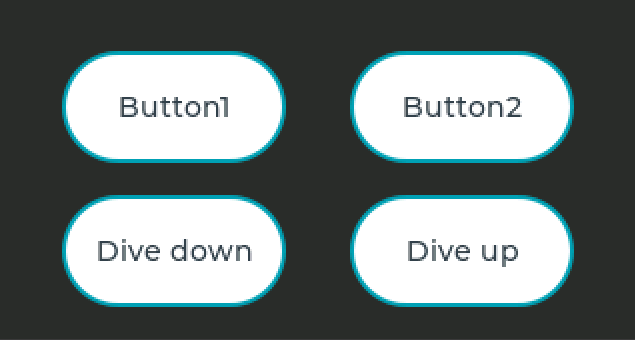

# Project


This project is an informatics-project for my studies at TH Cologne.
The goal was to create a UI for a computer used while free-diving.
It should show different diving-data like heart-frequency, current depth or o2-saturation in the users blood, while diving.
To give the user also a better understanding how his body works underwater the ui shows the user a chart after a dive.
For eaxmple: with the diving-data collected the user can get a better understanding how much o2-saturation is consumed while he is deeper underwater.

# How to use
## Get started
If you want to use this UI do the following:
1. Download & Install [Arduino](https://www.arduino.cc/en/software)
2. Download this [repository](https://github.com/ShadeForge/UI-Dive-Computer/archive/main.zip)
3. Setup Arduino with your board & librarys (also the lvgl-library)
   1. Select your board under menu->tools (if not in the list it could be that you have to add a library of your board before you can select it)
   2. Install your needed libraries & the lvgl-library under menu->tools->library-manager
4. Extract the directory of the repository-zip into your sketchbook (menu->sketch->show sketchbook-directory)
5. Move the lv_conf.h from the extracted folder beneath the lvgl-library-directory
   1. Open your sketch-book-directory
   2. Copy lv_conf.h & paste it into the libraries-directory
   3. Change the lv_conf.h to your preferences (screen-size, memory-size etc.)
   4. Open the "UIConfig.h" in the repository & change the SCREEN_WIDTH, SCHREEN_HEIGHT with your screen-size
6. Setup your general hardware-specific-code in your main
7. Call ```UISystem::setup();``` in your main


Now it should be able to compile the project in Arduino & should show you a digital-clock on your display if uploaded

## General-usage

Since this is just a UI it can only work properly with dive-data & a setup of your board/hardware.
For just demonstration or testing purposes you can enable Dive-Simulation in the lv_conf.h.
This generates some dump-data and extends the displays-height to add a button-area to simulate a button-press or diving-down/up.

To load your own dive-data into the UI do the following:
1. Open the "UISystem.cpp", go into ```UISystem::setup()``` and look for this code-section:
```c++
lv_task_create([](lv_task_t* task){
  #pragma region Dive-Simulation-DumpData-Generation
  ...  
  #pragma endregion

  // ToDo: Insert here your Data Update Logic

  // Update current screen
  switch(currentScreen) {
  ...    
  }
}, 500, LV_TASK_PRIO_MID, NULL);
```
2. Write there your dive-data-update-logic (you can use the Dive-Simulation-DumpData-Generation-region as example)

Now your dive-data should be updated all 500ms.

## Layout-Preferences
It is possible to change layouts & colors to some extend.
Just be aware that if you want to change the layout entirely make sure to look into the [lvgl-documentation](https://docs.lvgl.io/latest/en/html/)

### Colors & Assets
In the UIConfig.h you can change the theme-color or add new assets like fonts/images.
To do that just change the ```THEME_PRIMARY_COLOR_NORMAL``` or ```THEME_SECONDARY_COLOR_NORMAL```.
It changes the brighter/darker variables automatically but you can also change them to completely new colors.

### Layout-setup
In every screen-class is a setup-function to create the layout of the ui.
If you want to change a layout you can use the variables at the beginning of each screen-setup-function.
There are explainations what these variables change.
They can change images/fonts, positions, size to some extend.
If you want to change the layout completely make sure to read the [lvgl-documentation](https://docs.lvgl.io/latest/en/html/)
and feel free to modify the code in the lower-section of the setup-functions.

## Options-Menu


The option-screen is used for options like blue-tooth enabling or change modes for water-types.
To add your own option you have to do 3 changes:

1. Change the layout variables to support more buttons
2. Code the button-layout and insert them into the ```lv_obj_t* buttons[]``` array
3. Extend the ```void processButtonPress(ButtonType)``` with a new possible button selection

## Dive-Simulation


The dive-simulation is used for testing/debugging purposes if a board is currently unavailable.
If you want to use the simulation you need to go through this [simulation-doc](https://docs.lvgl.io/latest/en/html/get-started/pc-simulator.html).
I only got this feature to work on VS Code with PlatformIO under windows 10.
To use the simulation just go into the ```lv_conf.h``` enable the dive-simulation with a 1
 (```#define DIVE_SIMULATION 1```). Copy the whole code of the UI into the new simulation-code which you should have after going through the lvgl-simulation-documentation.
After that you need to run the task ```Build (emulator_64bits)``` to compile & run ```Execute (emulator_64bits)``` to execute the emulator.

### Problems
If you encounter the same problem like me that the logs say there was no executable you need to run the exe on your own.
One other problem to mention is that i needed to change the ```lv_conf_internal.h``` since for some reason the compiler does not used my ```lv_conf.h```
